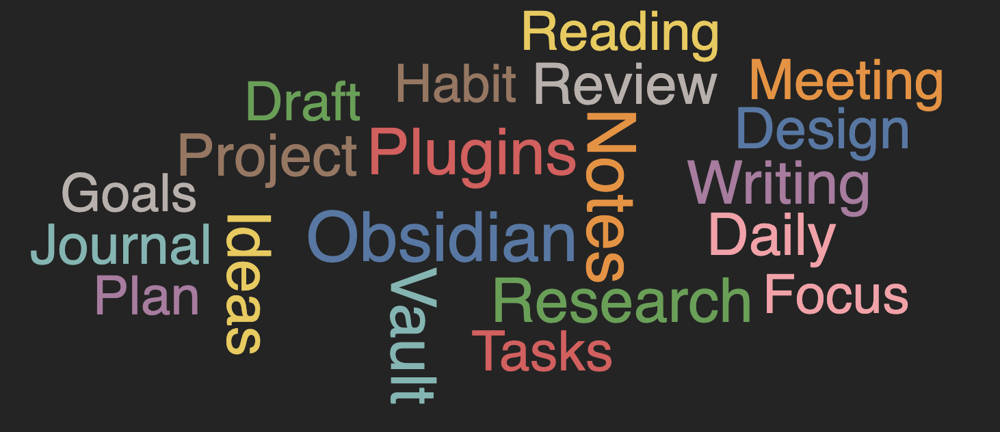

# Obsidian Word Clouds

Embed interactive word clouds directly into your Obsidian notes on Desktop and Mobile.

**Word Clouds** allows you to generate visualizations of frequently used words from your entire vault, a specific file, folders, tags, or other subsets of your notes — all from within any document.

---

## Core Features

> Mobile and Desktop supported!

* Embed interactive word clouds into any note
Supports a command to insert a cloud, or '/' commands inline

** TODO: **
- add support for quick embed. doing / then enter twice on the command will auto embed a default document scope wordcloud
- Frequency chart alternate view (some consider more reliable for infering meaning)

* Target your:

  * Entire vault
  * Specific file
  * One or more folders
  * Tagged notes
* Built-in Natural Language Processing (NLP) word filtering

  * Configurable to refine included/excluded terms
* Interactable rendered view

  * Click words to explore related notes
  * Modify exclusions directly from the visualization
* Per-word-cloud configuration overrides via UI

  * No manual markdown editing required
* Export generated word clouds to:

  * PNG
  * SVG
  * JPEG
    *(Desktop only — mobile export not currently supported)*

---

## What This Plugin Does

Word Clouds enables quick visual analysis of:

* recurring concepts
* dominant themes
* project-specific terminology
* topical note clusters

By embedding multiple word clouds with different filters into your notes, you can visualize distinct areas of your knowledge base independently.
- Have a transcript for your meeting? Throw it in a doc and get a wordcloud
- Curious what words are used across songs by your favorite artist? Add their lyrics to your vault and find out.
- 

---

## Getting Started

### 1. Embed Your First Word Cloud

Use the plugin command "command name here" to embed a word cloud into your current note.
or use the inline / command (check if this needs to be enabled in settings for vaults)

By default, this will target your **immediate file**, allowing you to immediately visualize frequently used terms.

By clicking any word in the cloud you can see all occurrences across your vault or files... need to implement this.

This provides a high-level view of:

* dominant themes
* recurring terminology
* commonly referenced concepts

---

### 2. Customize Any Word Cloud with the UI

Each embedded word cloud can override your default plugin settings.

Click into the embedded word cloud to edit its configuration using a clean, interactive UI.

This allows you to:

* filter by tags
* target folders or files
* adjust exclusions
* modify visualization settings

All without manually editing markdown or block configuration.

---

### 3. Export Your Word Cloud

Any generated word cloud can be exported to:

* PNG
* SVG
* JPEG

> **Note:** Mobile support for exporting is not currently available.

---

## Works Fully Offline

This plugin:

* Makes **no web requests**
* Captures **no user data**
* Runs **entirely on-device**
* Keeps your vault **private**

All analysis and visualization is performed locally within Obsidian.

---

## Performance Expectations

PUT IN PERFORMANCE NUMBERS since I got them

Have vault level renders not automatically refresh since they won't often change. Will refresh on open of document, but not when immediate document changes. Maybe have rerenders not unload the last view when gathering data for the next render.

Run document level re render on every edit to the file.

* Extremely fast for small vaults
* Responsive for medium vaults
* Decent performance for large vaults

Word Clouds processes only the notes required for the embedded configuration and avoids unnecessary vault-wide scans where possible.

---

## Platform Support

* Desktop ✔️
* Mobile ✔️

Word Clouds is designed to function across both environments.

---

## Installation

### Community Plugins (Recommended)

1. Open **Settings → Community Plugins**
2. Browse for **Word Clouds**
3. Install and enable the plugin

---

## Roadmap

Features will be guided by user feedback or personal use cases.

If you have ideas or encounter issues, please open an issue or submit a pull request:

### Feature Requests

Share ideas for new features or improvements:
[Submit a feature request](https://github.com/stretchycritter/obsidian-word-clouds/issues/new?template=feature_request.yml)

### Bug Reports

Report bugs or unexpected behavior:
[Report a bug](https://github.com/stretchycritter/obsidian-word-clouds/issues/new?template=bug_report.yml)

---

## Privacy

Word Clouds is designed to share no data.

* No vault content is transmitted outside your device
* No analytics or telemetry are collected
* No network access is required
* All processing occurs locally within your Obsidian environment

Your notes remain private and under your control at all times.

---

## Development

If you are a developer and would like to run or modify the plugin locally, see:

[`DEV.md`](./DEV.md)
